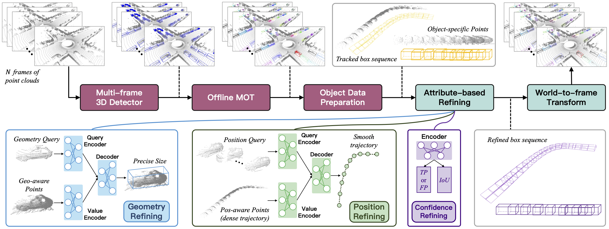

<div align="center">   

# DetZero
</div>

This repository is the official implmentation of [DetZero: Rethinking Offboard 3D Object Detection with Long-term Sequential Point Clouds](https://arxiv.org/abs/2306.06023).

https://github.com/PJLab-ADG/DetZero/assets/25716775/bbbd8735-25f9-4d64-a388-033970de7c06



## Overview
- [Highlights](#highlights)
- [Changelog](#changelog)
- [Project Structure](#project-structure)
- [Intallation](docs/INSTALL.md)
- [Data Preprocess](docs/DATA_PREPROCESS.md)
- [Running](#running)
- [Main Performance](#main-performance)
- [Cite](#cite)
- [Contact](#contact)
- [Acknowledgement](#acknowledgement)


## Highlights
- **`2024-03-26`** :hourglass_flowing_sand: We are going to release the trained model at [this link](https://drive.google.com/drive/folders/1SUzMox9oNte_DYkeceERDSNMWvKKUeGn?usp=sharing).
- **`2023-08-24`** :dart: DetZero code is released.
- **`2023-07-14`** DetZero is accepted by ICCV 2023.
- **`2023-06-12`** The first version of DetZero [paper](https://arxiv.org/abs/2306.06023.pdf) is available on arXiv.
- **`2023-03-08`** :trophy: Our DetZero ranks <b>1st</b> place with 85.15 mAPH (L2) performance on the [Waymo 3D detection leaderboard](https://waymo.com/open/challenges/2020/3d-detection/) among all the submitted methods.


## Changelog
**[2020-03-16]** `DetZero` v0.1.0 is released.


## Project Structure

```
  DetZero
  ├── detection
  │   ├── detzero_det
  │   │   │── datasets
  │   │   │   │── DatasetTemplate: the basic class for constructing dataset
  │   │   │   │── augmentor: different augmentation during training or 
  │   │   │   │── processor: processing points into voxel space
  │   │   │   │── waymo: the specific dataset module
  │   │   │── models: detection model related modules
  │   │   │── utils: the specific utils only used in detection module
  │   ├── tools
  │       ├── cfgs
  │       │   │── det_dataset_cfgs
  │       │   │── det_model_cfgs
  │       ├── train / test / visualize scripts
  │
  ├── tracking: the tracking module
  ├── refining: the refining module
  ├── utils: the libraries and functions used in all the other modules
  ├── evaluator: the offline evaluation tool
  ├── data: the root path of dataset raw data and the generated annotations
  ├── daemon: the supplementary tool module for processing refining results

```


## Running
- Please enter in the specific algorithm module and read the corresponding `README.md` for more details.


## Main Performance
- We report average APH (L1/L2) across all categories on the validation set of Waymo dataset. We also provide the training configurations to resume the models. Please note that Waymo open dataset is under strict non-commercial license so we are not allowed to share the model with you if it will be used for any profit-oriented activities.


| DET | TRK | GRM | PRM | CRM | mAPH_L2 | VEH | PED | CYC | Log |
| :---: | :---: | :--: | :--: | :--: | :---: | :---: | :---: | :---: | :---: |
| &check; |   |   |   |   | 76.24 | 82.57/75.09 | 83.23/76.47 | 79.35/77.16 | [log](docs/log_det_and_track_eval.txt) |
| &check; | &check; |   |   |   | 76.44 | 82.57/75.24 | 83.07/76.34 | 79.86/77.75 | [log](docs/log_det_and_track_eval.txt) |
| &check; | &check; | &check; |   |   | 78.00 | 84.49/77.17 | 84.71/78.04 | 80.23/78.08 | [log](docs/log_combination_eval.txt) |
| &check; | &check; |   | &check; |   | 78.25 | 85.48/78.55 | 84.32/77.78 | 80.49/78.43 | [log](docs/log_combination_eval.txt) |
| &check; | &check; | &check; | &check; |   | 79.79 | 87.81/81.01 | 85.94/79.48 | 80.97/78.87 | [log](docs/log_combination_eval.txt) |
| &check; | &check; | &check; | &check; | &check; | 81.70 | 89.06/82.92 | 87.06/81.01 | 83.11/81.17 | [log](docs/log_combination_eval.txt) |


## Cite
If you find our work helpful, please kindly cite our paper:
```bibtex
@inproceedings{ma2023detzero,
  title = {DetZero: Rethinking Offboard 3D Object Detection with Long-term Sequential Point Clouds},
  author = {Tao Ma and Xuemeng Yang and Hongbin Zhou and Xin Li and Botian Shi and Junjie Liu and Yuchen Yang and Zhizheng Liu and Liang He and Yu Qiao and Yikang Li and Hongsheng Li},
  booktitle = {Proceedings of International Conference on Computer Vision (ICCV)},
  year = {2023}
}
```


## Contact
- If you have any question about this repo, please contact us through `taoma@link.cuhk.edu.hk` and `shibotian@pjlab.org.cn`.


## Acknowledgement
The structure of our project is totally based on [OpenPCDet](https://github.com/open-mmlab/OpenPCDet), leading to an easy way for further research and development. We also sincerely appreciate the following open-source projects for providing valuable and high-quality codes:
- [OpenPCDet](https://github.com/open-mmlab/OpenPCDet)
- [mmdetection](https://github.com/open-mmlab/mmdetection)
- [CenterPoint](https://github.com/tianweiy/CenterPoint)
- [PDV](https://github.com/TRAILab/PDV)
- [TransFusion](https://github.com/XuyangBai/TransFusion)
- [CT3D](https://github.com/hlsheng1/CT3D)


## TODO List
- [x] Code released with version 0.1.0
- [ ] Training log files under new code structure
- [ ] A sample of data for running DetZero
- [ ] Test-time augmentation of GRM and PRM
- [ ] Multi-gpu inference for refining module
