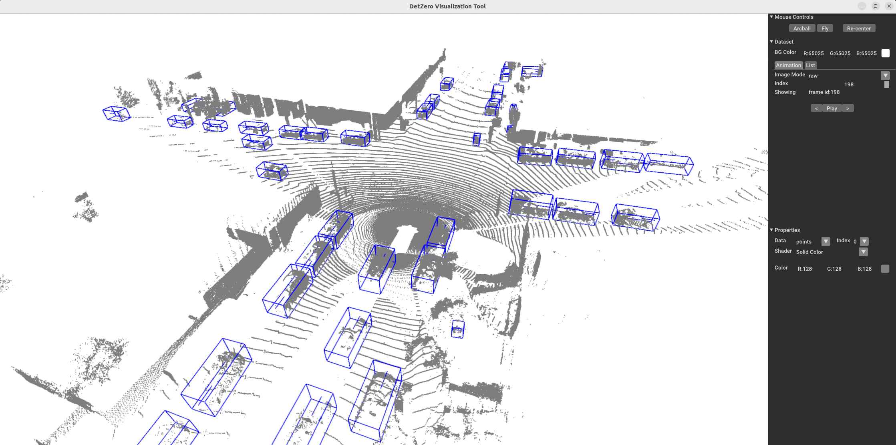

# DetZero - Daemon Module


## Intro
- This is the Daemon module of DetZero framework. It can be viewed as a supplementary tool of Refining for processing the training data, final result and so on.

- Object data preparation is necessary for the following refining models. Hence, we run this module for train, validation, test split respectively (use `--split` to specifiy the corresponding split and `--track_data_path` to specifiy the path to tracking result). Besides, each processing is running for a single object category.
```shell
cd DetZero/daemon &&
python prepare_object_data.py --track_data_path <PATH_TO_TRACK_RESULT> --split <DATA_SPLIT>
```

- Our CRM is composed of two branches. One of them is to predict the IoU between the predicted boxes (after geometry and position refining) and ground-truth boxes. Hence, we use the inference result of training set with GRM and PRM models to generate IoU ground-truth.
```shell
cd DetZero/daemon &&
python generate_iou_gt.py --class_name <CLASS_NAME> --geo_path <PATH_TO_GEOMETRY_RESULT> --pos_path <PATH_TO_POSITION_RESULT>
```

- The final result will be the combination of the inference results of GRM, PRM and CRM. The different combination of geometry, position, and confidence refining results can also be combined for ablated evaluation. We use `--track_save` to save the combined results as the object track format, `--frame_save` to save the combined results as the frame-level list format, which is used to evaluate the final mAP of Waymo dataset.
```shell
cd DetZero/daemon &&
python combine_output.py --split val --combine_drop_path <PATH_TO_DROP_DATA> --combine_conf_res --track_save --frame_save
```


### Visualization
- requirements: open3d (system required: Ubuntu>=18.04, if you need to visualize the tracking results in your local machine)

- a. visualization with one scene of Waymo Dataset
```shell
python visualizer.py --data_path <DATA_PATH> --seq_name <SCENE_NAME> --pts_path <POINT_CLOUD_PATH>
```

- b. screenshot of visualizer tool 



## Note
- These codes are very easy to re-implement, please feel free to modify them for your requirement.

